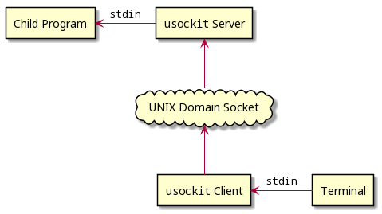

<!--
  Copyright (c) 2022 Michael Federczuk
  SPDX-License-Identifier: CC-BY-SA-4.0
-->

# usockit #

[version_shield]: https://img.shields.io/badge/version-0.1.0--indev02-informational.svg
[release_page]: https://github.com/mfederczuk/usockit/releases/tag/v0.1.0-indev02 "Release v0.1.0-indev02"
[![version: 0.1.0-indev02][version_shield]][release_page]
[](CHANGELOG.md "Changelog")

## About ##

`usockit` is a program to asynchronously send data to another program's standard input stream.

### The Problem ###

Given a program (e.g.: some server application) that reads commands from its standard input.  
It is desired that this program runs in the background, even without a controlling terminal — i.e.: `nohup <program> &`

Without a controlling terminal, the standard input can not be accessed.

Letting the program read from a regular file or from a FIFO special file (named pipe) wouldn't work since an EOF would
be sent, which would stop any command processing form the programs side.

### A Solution ###

Have an extra program (the `usockit` server) listen to a [UNIX domain socket]. Any data sent to this socket is forwarded
to the original program's standard input.  
Yet another program (the `usockit` client) would connect to the UNIX domain socket and would forward **its**
standard input to the socket.  
Since the client programs are completely decoupled from the original program, client connections are able to be closed
and reopened without influencing the original program.



[UNIX domain socket]: <https://en.wikipedia.org/wiki/Unix_domain_socket> "Unix domain socket - Wikipedia"

## Usage ##

```shell
usockit console_socket -- prog arg1 arg2 ... argN
```

This will create a new UNIX domain socket called `console_socket` and execute the program `prog` with the arguments
`arg1`, `arg2`, `...` and `argN`.  
The child process' standard input is controlled by the `usockit` server, to send data to it, a `usockit` client must be
connected to the same socket:

```shell
usockit console_socket
```

The `usockit` binary will know that this is supposed to be a client and not a server since there is no command specified.

The client will now read from **its** standard input until end-of-file and will transfer all data to the socket, where
the server will pick it up and forward it to the child program.

## Download & Installation ##

Download & installation must be done manually by cloning this repository and building from source:

```sh
git clone 'https://github.com/mfederczuk/usockit.git' -o 'usockit' &&
	cd 'usockit' &&
	make build_type=release &&
	sudo make build_type=release install
```

## Contributing ##

Read through the [Contribution Guidelines](CONTRIBUTING.md) if you want to contribute to this project.

## License ##

**usockit** is licensed under both the [**Mozilla Public License 2.0**](LICENSES/MPL-2.0.txt) AND the
[**Apache License 2.0**](LICENSES/Apache-2.0.txt).  
For more information about copying and licensing, see the [`COPYING.txt`](COPYING.txt) file.
